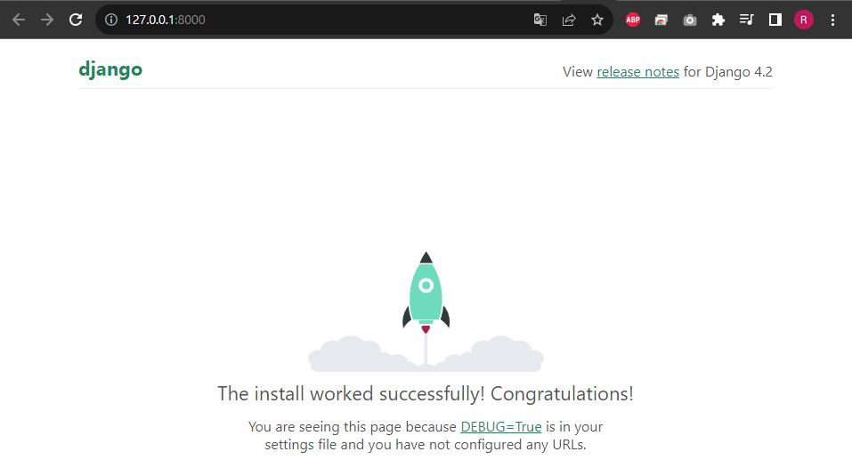

# DJango
## 설치하기
python3 -m pip install django

## Project 생성
다음 코드를 통해 프로젝트를 생성
- django-admin startproject pj_name
pj_name 디렉토리를 생성하면서 프로젝트가 시작됨

**현 위치에서 프로젝트를 생성하기 위해서는 .을 사용**
django-admin startproject pj_name .

### settings.py : 프로젝트 운영과 관련된 설정이 포함된 파일(중요)

### urls.py : 사용자가 접속하는 path에 따라서 접속요청을 어떻게, 누가 처리할 것인지를 지정해주는(routing) 파일

### manage.py : 프로젝트 진행에서 필요한 기능(utility)을 담당하는 파일

## 서버 시작
- python3 manage.py runserver

- python3 manage.py runserver port_num
**port_num에 원하는 수치를 입력함으로써 8000(default)가 아닌 포트에서 서버가 작동**
포트 : 서버에서 여러 개의 서버 프로그램이 작동하고 있을 경우, 각각의 프로그램에 접속하기 위해서(listening) 사용하는 개념

## Django Framework
- 프로젝트 내에서 application을 구성하기보다는 App이라는 단위로 묶어서(grouping) 구현
- 각각의 app마다 urls.py를 포함하고 view와 model을 생성
- view에는 필요한 기능에 대한 함수를 적재
- 사용자는 프로젝트 url을 통해 접속하고 사용하고자 하는 app의 url을 통해 접근
- 해당 app 내의 view에서 함수를 불러오고 함수는 model을 통해서 DB에 접속
- DB에서 불러온 정보를 사용해 함수는 결과값을 도출하고, 이를 html, xml, json과 같은 여러가지 형태로 사용자에게 제공

## App 생성
- django-admin startapp app_name
app_name이라는 디렉토리를 생성하면서 app이 생성

## Routing(route : 경로)
사용자가 접속한 각각의 경로를 누가 처리할 것인지를 결정하는 것
- django에서는 project 내의 urls.py에서 가장 큰 틀의 routing을 담당
- project의 urls.py에서 위임한 app이 view안에 있는 특정 함수로 위임하여 작동

### urls.py 작성
**project 내의 urls.py**
- urlpatterns라는 이름의 리스트를 반드시 정의(routing과 관련된 정보)
- 'admin/'(default 설정) : django가 기본적으로 가지고 있는 관리자 화면으로 이동하기 위한 설정
- Including another URLconf
    - 1. Import the include() function: from django.urls import include, path
        - 다른 urls.py로 위임하기 위해서는 include라는 모듈을 import 해야 함
    - 2. Add a URL to urlpatterns:  path('app_name/', include('app_name.urls'))
        - urlpatterns에 위임하고자 하는 app의 이름(app_name)을 path로 추가
        - 위임된 경로(app_name/)에도 urls.py 파일이 필요
            - 상위 경로가 아니므로 admin과 관련된 내용은 불필요
- urlpatterns 리스트에 작성한 앱의 경로(path("", include('app_name.urls')))에서 ""의 문자열은 사용자가 최초 접속했을 때의 경로(http://127.0.0.1/ (default))를 의미
    - path("app/", include('app_name.urls')) 일 경우, http://127.0.0.1/ (default)가 아닌 http://127.0.0.1/app/ 으로 접속했을 때 app_name이라는 app의 urls.py로 위임하도록 작동함
**app 내의 urls.py**
- urlpatterns 리스트 내의 path 설정에서 해당 app에 생성된 views.py에서 정의한 함수로 연결해주어야 함
    - 이 때, 해당 app의 views 모듈을 import 해줄 것
- 사용자가 path가 없는 경로(urlpatterns에 추가되지 않은 경로)로 접속했을 경우, Not Found 페이지로 이동

## Web Server VS Web Application Server
### Web Server ex) apache, nginx, IIS
- 필요한 웹 페이지를 미리 생성
- 접속했을 때, 특정 페이지로 이동(href)
- 정적(static) : 한번 작성된 방식으로만 작동
- 성능이 빠름

### Web Application Server ex) django, flask, php, jsp, ROL
- 웹 페이지를 생성하는 프로그램을 제작(views.py)
- 사용자가 접속할 때, 해당 경로에 대한 DB를 참조하여 웹페이지를 제작
- 동적(dynamic) : 요청이 들어올 때마다 필요한 정보를 작성
- Web server에 비해 느림
- 유지보수의 편의성
- 개인화

## CRUD
### Create
### Read
1. homepage : '/'
2. article(상세보기) : '/read/<id>'
### Update
### Delete